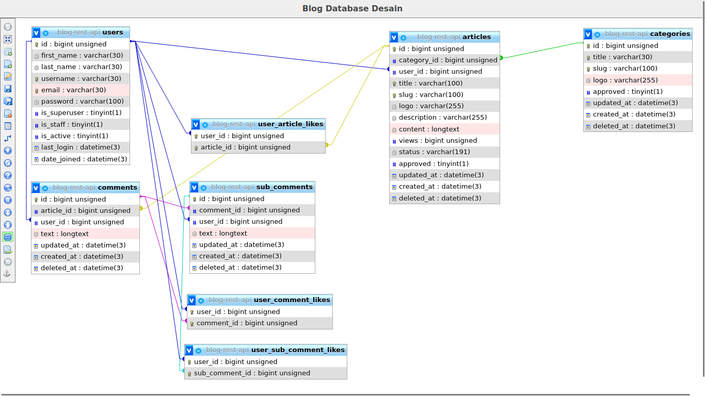

# Blog Rest API

Creating a web api blog program using the `Go` programming language and the `gin-gonic` package.
Then I create a model for authentication using `JSON Web Token` or `JWT Authentication`

Here I use a third party package, namely:
- [gin-gonic](https://github.com/gin-gonic/gin)
- [bcrypt](https://golang.org/x/crypto/bcrypt)

# Desain Of Entity Relation Diagram(ERD)

In the picture below is the appearance of the entity relation diagram design.

## URL Route

### Users

All methods for all users handler

| URL                  | Query | Method | Description                           |
|----------------------|-------|--------|---------------------------------------|
| `/v1/auth/user`      |  `-`  | `GET`  | `Check the authentication with token` |
| `/v1/auth/sign-up`   |  `-`  | `POST` | `Account Registration`                |
| `/v1/auth/get-token  |  `-`  | `POST` | `Get New Token`                       |

### Categories

All methods for categories handler

| URL               | Query  | Method   | Description                |
|-------------------|--------|----------|----------------------------|
| `/v1/categories`  | `-`    | `GET`    | `Get All Categories`       |
| `/v1/categories` | `-`    | `POST`   | `Add New Category`         |
| `/v1/categories`  | `slug` | `PUT`    | `Edit/Update The Category` |
| `/v1/categories` | `slug` | `DELETE` | `Delete category with ID`  |

### Articles

All methods for article handlers

| URL            | Query  | Method   | Description                       |
|----------------|--------|----------|-----------------------------------|
| `/v1/articles` | `-`    | `GET`    | `Get All Articles`                |
| `/v1/articles` | `slug` | `GET`    | `Get Article With Slug`           |
| `/v1/articles` | `-`    | `POST`   | `Add New Article`                 |
| `/v1/articles` | `slug` | `PUT`    | `Edit/Update the article with ID` |
| `/v1/articles` | `slug` | `DELETE` | `Delete the article with ID`      |

### Comments

All methods for comment handlers

| URL                           | Query        | Method   | Description                                          |
|-------------------------------|--------------|----------|------------------------------------------------------|
| `/v1/articles/comment/add`    | `slug`       | `POST`   | `Create new comment with filtering the slug article` |
| `/v1/articles/comment/edit`   | `comment_id` | `PUT`    | `Edit/Update the comment with comment id`            |
| `/v1/articles/comment/delete` | `comment_id` | `DELETE` | `Delete the comment with given the id`               |